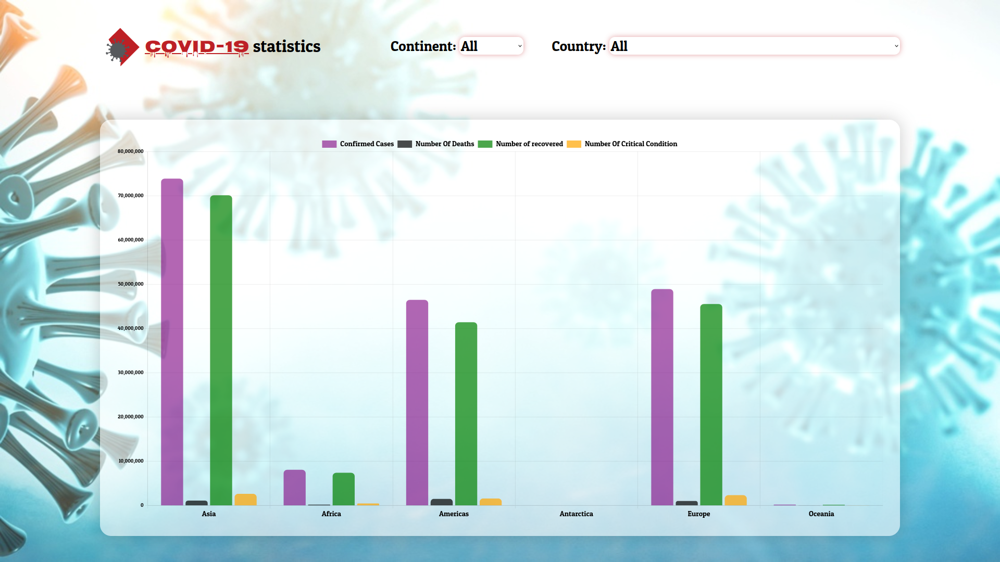

# :test_tube: Covid-19 Statistics

An application that allows you to examine Covid-19 influence on counties in the world by statistics.

## :wrench: Installation

- [chart.js](https://www.chartjs.org/)

- Using json-server package as temporary database.
- Using SASS as CSS extension language.

## :rocket: Contributing

Requested APIs from:

- [about-corona.net](https://about-corona.net/)
- [Hengkiardo-Git](https://github.com/hengkiardo/restcountries)

## :beers: recognition 

A great thanks for Appleseeds bootcamp!
